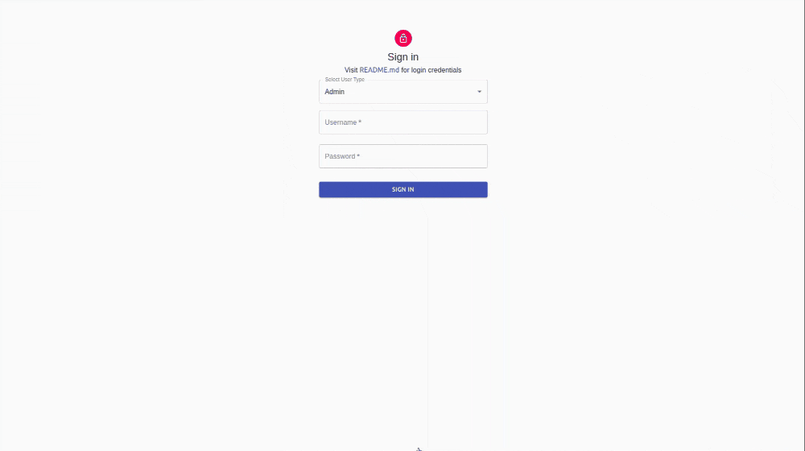
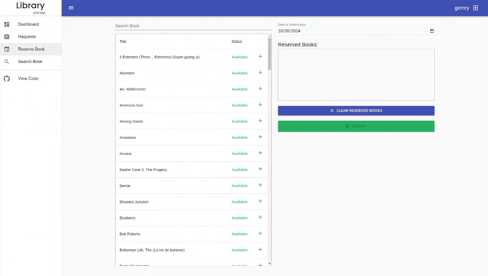

# [Library Management System](https://library-system-mern.fly.dev/)

A simple Library Management System built using MERN stack.




## Table of Contents
 - About the Project
 - Features
 - Usage
 - Built With
 - Getting Started

## About the Project
This Library Management System is a full-stack application designed to help administrators manage book records, student borrowing, and return activities. It is built using the MERN stack (MongoDB, Express, React, and Node.js) and secured with JWT for authentication.

## Features
- Admin Dashboard: Manage books, view borrowing history, and handle user accounts.
- Student Portal: Search and borrow books, view personal borrowing history.
- Authentication: JWT-based authentication for secure access.

## Usage
You can use the demo version with the following credentials:

- Admin:

  - Username: sarah
  - Password: sarah
- Student:
  - Username: gemry
  - Password: gemry

[View the demo here](https://library-system-mern.fly.dev/)

## Built With
### Frontend
  - [React](https://reactjs.org/)
  - [Material-ui](https://material-ui.com/)

### Backend
- [Node](https://nodejs.org/en/)
- [Express](https://expressjs.com/)
- [MongoDB](https://www.mongodb.com/)
- [Mongoose](https://mongoosejs.com/)
- [JWT](https://jwt.io/)

## Getting Started
### Prerequisites
To run this project locally, you’ll need:

- Node.js installed on your machine.
- MongoDB for the database.

### Installation
1. Clone the repository:
    ```bash
    git clone https://github.com/bgemry34/library-system-mern.git
    ```

2. Install dependencies for both the frontend and backend:
    ```bash
    cd library-system-mern
    npm install
    cd client
    npm install
    ```

3. Set up environment variables:
    - Create a `.env` file in the root directory and add the following:
      ```makefile
      MONGO_URI=your-mongo-db-uri
      JWT_SECRET=your-secret-key
      PORT=your-port-number
      ```

4. Run the application:
    - For the backend:
      ```bash
      npm run server
      ```
    - For the frontend:
      ```bash
      npm run client
      ```

5. Access the app at `http://localhost:3000`.